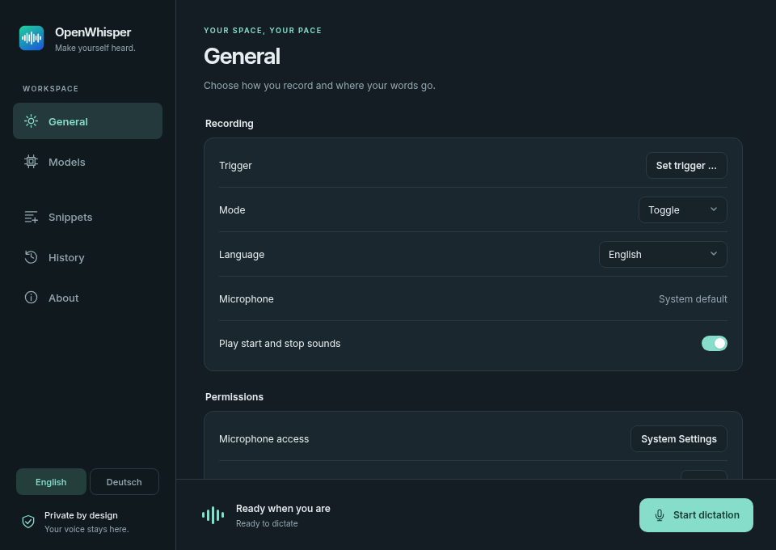

# OpenWhisper

**Press. Speak. Keep writing. Local dictation for macOS and Linux.**

[](https://github.com/juferdinand/OpenWhisper/actions/workflows/ci.yml)
[](LICENSE)
[](#requirements)
[](#linux-compatibility)

OpenWhisper turns speech into text locally on your computer, with a shared custom interface
and native audio and desktop integration. On macOS,
press <kbd>⌥</kbd> + <kbd>Space</kbd>, speak, then press the shortcut again:
your text is pasted into the active text field. No account, API key, or subscription.

> **App language:** Switch between English and German in the sidebar. Dictation supports multiple languages.

[Installation](#installation) · [Features](#features) · [Privacy](#privacy) ·
[Roadmap](docs/ROADMAP.md) · [Contributing](#contributing) · [Report an issue](https://github.com/juferdinand/OpenWhisper/issues)



Both desktop apps load the same layout, original logo, and bundled font. Native window borders,
permission dialogs, and available OS integrations vary by platform.

## Project status

OpenWhisper is in early development. Download the packaged macOS or Linux app from
[GitHub Releases](https://github.com/juferdinand/OpenWhisper/releases/latest), or build it from source.

| Platform | Status |
| --- | --- |
| macOS 14+ | Native Swift services; universal package for Apple Silicon and Intel |
| Linux x86_64 | AppImage / `.deb` releases; CachyOS with KDE Plasma / Wayland is the primary test system |
| Windows | Planned, not implemented yet — see the [platform plan](docs/PLATFORMS.md) |

### Linux compatibility

Linux x86_64 releases are available as AppImage and `.deb` packages. Source is in `desktop/`.
Version 0.2.3 adds single-key triggers on KDE Plasma 6 and direct extra mouse buttons on
KDE Wayland (middle button: Plasma 6.3+), with saved bindings and no root access. Other desktops
retain portal-based shortcuts. Version 0.2.4 adds isolated, adaptive recognition and local recovery
for stopped Linux recordings.
KDE integration is detected through KWin and KGlobalAccel capabilities, not a CachyOS check.
Other distributions with the required Plasma 6 services can use that implementation, but each
desktop/package combination still needs its own acceptance evidence.
See [trigger setup and limitations](docs/LINUX.md#first-use).
Distribution targets below are **not claims of completed end-to-end testing**. On Linux, desktop environment, Wayland/X11, audio services, and portal support
determine which features work. See the [Linux implementation and test plan](docs/LINUX.md).

| Distribution/session | Status | Feature coverage / limits |
| --- | --- | --- |
| CachyOS x86_64, KDE Plasma 6, Wayland, PipeWire | Primary test system; native UI, floating recorder, both CPU engines, clipboard, and AppImage launch checked | See the detailed [validation evidence](docs/LINUX.md#validation-status); real microphone and broader desktop checks remain |
| Arch Linux and derivatives, KDE Wayland | Targeted; untested | Same integration path, subject to installed portal backend |
| Ubuntu LTS / Debian, GNOME Wayland | Targeted; untested | Local dictation and clipboard; shortcuts/pasting depend on portal support |
| Fedora, GNOME or KDE Wayland | Targeted; untested | Local dictation and clipboard; shortcuts/pasting depend on portal support |
| X11 desktops | Experimental; untested | Record button and `xclip`; KDE Plasma 6 has native key bindings; other desktops need a shortcut portal. Direct mouse capture on X11 is not implemented. |
| Sway / Hyprland and other Wayland compositors | Experimental target; untested | Capability-dependent; no blanket compatibility claim |
| Linux ARM64 or 32-bit | Outside the initial release scope | No packages or support claim |

Microphone recording, hotkeys, and automatic pasting must pass an end-to-end test on a desktop
before it is listed as tested. Clipboard output is the fallback for unavailable
or denied input permissions. See [Linux build and setup](docs/LINUX.md#build-from-source) and
the [feature and validation checklist](docs/LINUX.md#validation-status).

## Features

Both platforms provide local recognition, vocabulary correction, snippets, models, history,
English/German settings, and recording controls. Host-specific differences are called out below
and in [docs/LINUX.md](docs/LINUX.md).

- **System-wide dictation:** Paste text into the active text field, copy it to the clipboard, or open it in a text editor.
- **Your preferred trigger:** macOS supports keyboard shortcuts, individual modifiers, Fn, and extra mouse buttons. Linux supports native Plasma 6 keys, KDE Wayland mouse buttons, and a shortcut portal fallback. KDE modifier-only triggers use toggle mode; other supported triggers also offer push-to-talk.
- **Local speech recognition:** OpenAI Whisper and NVIDIA Parakeet through [whisper.cpp](https://github.com/ggml-org/whisper.cpp), with Metal on macOS and Vulkan with CPU fallback on Linux.
- **Model management:** Download and select catalog models on both platforms. macOS also provides deletion, custom ggml import, and hardware-based recommendations.
- **Vocabulary and snippets:** Correct custom terms and replace spoken phrases with saved text, such as “my link” with a URL.
- **Floating overlay:** A shared recording level, timer, stop/cancel controls, and processing status. It stays above your work without taking keyboard focus. Linux requires a compatible compositor; see the support matrix.
- **No fixed recording limit:** Recording continues until you stop or cancel it. Audio stays in memory, so longer recordings use more RAM.
- **Linux recording recovery:** Stopped recordings are privately backed up before recognition. Inference runs in a separate process, uses bounded sections, and retries failed sections with smaller windows and CPU fallback. After a failure or app restart, use **Retry transcription** or **Discard saved recording**. Successful clipboard delivery removes the temporary audio; unfinished WAV files remain in the XDG configuration directory under `whisperfree/recovery/`.
- **Everyday settings:** Launch at login and a local text history you can disable on both platforms. Sound cues, clipboard restoration, and text editor output are currently macOS features.

## Requirements

For Linux, see [dependencies and supported environments](docs/LINUX.md#build-from-source).
The packaged macOS app requires:

- A Mac running **macOS 14 or later**.
- A microphone and enough disk space for your chosen speech model; download sizes are shown in the app.
- To build from source: current **Xcode Command Line Tools** or Xcode with its Swift toolchain,
  plus **Node.js 22+ and npm** for the shared settings UI.
- Internet access to download the app and a speech model, or dependencies for a source build. Dictation works offline after setup.

## Installation

### Download the macOS app

1. Download and open the [**0.2.4 macOS DMG**](https://github.com/juferdinand/OpenWhisper/releases/download/v0.2.4/WhisperFree-macOS.dmg).
2. Drag the app onto the **Applications** folder in the window.
3. Eject the volume, open the app from **Applications**, and follow [Your first dictation](#your-first-dictation-macos).

A [0.2.4 ZIP download](https://github.com/juferdinand/OpenWhisper/releases/download/v0.2.4/WhisperFree-macOS.zip) is also available.

Releases use a persistent, self-signed certificate and are **not notarized by Apple**.
For these early open-source releases, this avoids the annual Apple Developer Program fee.
Developer ID signing and notarization remain a future option; see the [signing decision](docs/SIGNING.md).
If macOS blocks the first launch, review the app's origin and, if you choose to allow it,
use **System Settings → Privacy & Security → Open Anyway**.
See [Apple's instructions](https://support.apple.com/102445).

Each release includes `SHA256SUMS`. To verify the DMG download, place that file beside the DMG and run:

```bash
grep '  WhisperFree-macOS[.]dmg$' SHA256SUMS | shasum -a 256 -c -
```

### Build macOS from source

Install the Command Line Tools first if needed:

```bash
xcode-select --install
```

Clone the repository and build the app:

```bash
git clone https://github.com/juferdinand/OpenWhisper.git
cd OpenWhisper
make mac
open macos/build/OpenWhisper.app
```

The build automatically downloads the pinned whisper.cpp XCFramework and verifies its SHA-256
checksum. You can then drag the resulting `OpenWhisper.app` into `/Applications`.

Alternatively, `make mac-install` builds the app, replaces an existing installation in
`/Applications`, and launches it.

### Install the Linux app

Download the [**0.2.4 Linux AppImage**](https://github.com/juferdinand/OpenWhisper/releases/download/v0.2.4/WhisperFree-Linux-x86_64.AppImage)
from the release page, then run:

```bash
chmod +x WhisperFree-Linux-x86_64.AppImage
./WhisperFree-Linux-x86_64.AppImage
```

If FUSE is unavailable, run `APPIMAGE_EXTRACT_AND_RUN=1 ./WhisperFree-Linux-x86_64.AppImage`.
On Debian/Ubuntu, the alternative [**0.2.4 Debian package**](https://github.com/juferdinand/OpenWhisper/releases/download/v0.2.4/WhisperFree-Linux-amd64.deb)
can be installed with `sudo apt install ./WhisperFree-Linux-amd64.deb`.
Verify downloads with the release's `SHA256SUMS`. Linux updates use their own persistent signing key; see [signing](docs/SIGNING.md#linux-update-signatures).
Consult the [runtime dependencies and desktop support notes](docs/LINUX.md) before installation;
building the Debian package does not establish tested Debian/Ubuntu desktop support.

#### Install from the Linux terminal

You can download and install the Debian package from a terminal; a distribution package
repository is not configured yet. The example pins a published release so the package and its
checksums come from the same version. It requires `curl`, `sha256sum`, and `apt`:

```bash
(
  set -eu
  wf_version=0.2.4
  wf_release="https://github.com/juferdinand/OpenWhisper/releases/download/v${wf_version}"
  mkdir -p "openwhisper-download-v${wf_version}"
  cd "openwhisper-download-v${wf_version}"
  curl --fail --location --proto '=https' --proto-redir '=https' \
    --output WhisperFree-Linux-amd64.deb "$wf_release/WhisperFree-Linux-amd64.deb"
  curl --fail --location --proto '=https' --proto-redir '=https' \
    --output SHA256SUMS "$wf_release/SHA256SUMS"
  sed -n '/  WhisperFree-Linux-amd64[.]deb$/p' SHA256SUMS > deb.SHA256SUMS
  test "$(wc -l < deb.SHA256SUMS)" -eq 1
  sha256sum --check deb.SHA256SUMS
  sudo apt install ./WhisperFree-Linux-amd64.deb
)
```

Open OpenWhisper from the application launcher after installation so desktop portals use the
correct app identity. These checksums verify download integrity against the release manifest;
the in-app updater additionally verifies cryptographic package signatures.

For a per-user AppImage installation without administrator access, download and verify the
AppImage, then use the existing installer from a source checkout:

```bash
bash desktop/scripts/install-local.sh --appimage /absolute/path/to/WhisperFree-Linux-x86_64.AppImage
```

This installer does not build the app. It creates the desktop entry and installs the icon and
licenses. A standalone terminal installer and additional packaging channels are tracked in the
[roadmap](docs/ROADMAP.md#linux-installation).

### Build the Linux app

See [Linux build instructions](docs/LINUX.md#build-from-source), then run `make linux` and
`make linux-install`. The Linux app uses the same logo and the same settings navigation as macOS.
Both apps now render the same custom UI assets, including the bundled font and original logo;
permissions and feature availability are handled by their native backends.

## Updates, interface language, and setup

Use **About → Check now** to look for a new release on either platform. Automatic daily checks
are enabled by default and can be switched off there. Downloads and installation start only when
you choose **Download & install**. The app verifies the update and restarts; settings, models,
snippets, and saved history are retained. Finish recordings and model downloads before installing.

Linux 0.2.1 / 0.2.2 can close after installation when started by a systemd service. If this happens,
open OpenWhisper manually; the updated package is already installed. The restart correction in
0.2.3 takes effect for updates initiated from 0.2.3 onward.

- **macOS:** release builds verify the downloaded ZIP's app against the current signing identity.
- **Linux AppImage:** release builds replace the writable AppImage in place, using a signed,
  version-bound package. Keep the file in a permanent folder owned by your user. From a source checkout,
  `bash desktop/scripts/install-local.sh --appimage /path/to/OpenWhisper-Linux-x86_64.AppImage`
  installs a release for the current user with the correct desktop identity.
- **Linux Debian package:** verified updates use the system administrator authorization dialog
  (`pkexec` and `dpkg`). Cancelling the dialog cancels installation; the app never asks for your password.
- **Linux 0.2.0 and source/CI builds:** install the 0.2.1 release manually once to get the updater.
  Source and CI builds do not enable in-app installation.

The sidebar switches the shared interface between **English** and **Deutsch**, including recording
controls and native menus. The choice is saved independently of the speech-recognition language.
Project documentation remains in English. Setup appears on a fresh installation until you choose
**Finish setup**, then disappears. Existing installations migrate without reopening onboarding.

Version 0.2.2 adds Linux Vulkan GPU recognition and **General → Launch at login** on both
platforms. Compatible GPUs are used by default, with CPU fallback; a manual CPU choice is retained.
Whisper Tiny and Parakeet v3 q4 have been checked on an NVIDIA RTX 3060. Other GPUs need separate
validation; see [Linux GPU and autostart details](docs/LINUX.md#build-from-source). The published
0.2.1 Linux packages are CPU-only. On macOS, Metal acceleration is already enabled; pending login-item
approval is shown separately and can be cancelled from the app.

## Your first dictation (macOS)

1. Open OpenWhisper and follow the first-run setup. Click **Finish setup** when ready; it stays hidden after restarts and updates. Permissions and shortcuts remain available in **General**.
2. Download and select a model in **Settings → Models**.
3. Grant **Microphone** access.
4. Grant **Accessibility** access to paste text automatically. For manual pasting, select **Copy to clipboard only**.
5. Place your cursor in a text field. Press <kbd>⌥</kbd> + <kbd>Space</kbd>, speak, then press the shortcut again.

Transcription starts once recording stops. You can change the trigger, recording mode, language,
and output in settings. Without Accessibility access, standard keyboard shortcuts are available
as global triggers; individual modifier keys and mouse buttons require that permission.

## Models and languages

| Model family | Available in OpenWhisper | Language behavior |
| --- | --- | --- |
| OpenAI Whisper | Tiny, Base, Small, Medium, Large v3 Turbo; also a compressed Turbo model | Manual language selection or automatic detection; custom vocabulary is also passed as a recognition prompt |
| NVIDIA Parakeet TDT v3 | Full precision, q8, and q4 variants | Automatic language detection; manual language selection does not apply |

Vocabulary correction after recognition and snippets work with both model families.
Available files, download sizes, and the Parakeet language list are defined in the
[model catalog](shared/models.json). Recognition speed and quality depend on factors including
the model, hardware, language, and recording.

## Privacy

Speech recognition runs on your computer: in the macOS app process or the isolated Linux speech
helper. OpenWhisper does not upload audio
recordings or transcripts for recognition and has no telemetry integration.

The table below uses macOS paths. Linux storage paths and permissions are listed in
[Linux data storage](docs/LINUX.md#data-storage).

| Data or connection | Behavior |
| --- | --- |
| Audio | macOS processes samples in memory without audio files. Linux also captures in memory, then privately saves stopped recordings for recovery until successful clipboard delivery or explicit discard. |
| Models | Downloaded on request from Hugging Face, including its download infrastructure; stored in `~/Library/Application Support/WhisperFree/Models`. |
| Settings and history | Local User Defaults. By default, history stores the last 20 text dictations; disable or clear it under **History**. |
| Snippets | Stored locally in `~/Library/Application Support/WhisperFree/snippets.json`. |
| Text editor output | Writes text files to `~/Library/Application Support/WhisperFree/Transcripts`; existing installations keep their previous `Diktate` folder. These files persist independently of history. |
| Updates | Only when an update repository is configured: optional daily checks through GitHub, with an update downloaded after you click to install it. |

Output text goes to the clipboard and, depending on your settings, to the app you choose.
That app's storage and synchronization follow its own settings.

## Troubleshooting

Linux: run `openwhisper-desktop --diagnose` and consult [Linux troubleshooting](docs/LINUX.md#troubleshooting).
The table below applies to macOS.

| Problem | What to check |
| --- | --- |
| Text is not pasted | Grant Accessibility access to OpenWhisper and focus a text field. Alternatively, use clipboard mode and paste manually with `⌘V`. |
| “No microphone access” or “No audio detected” | Check microphone permission, the default input device, and the input level in macOS. |
| The shortcut does not respond | Try another shortcut and check for conflicts with system or app shortcuts. Fn, individual modifiers, and mouse buttons require Accessibility access. |
| Short phrases are recognized in the wrong language | Set the language explicitly when using Whisper. Parakeet always detects the language automatically. |
| Permissions stop working after a local rebuild | A changing ad-hoc signature can require permissions to be granted again; a persistent local development certificate helps. See [Development](#development). |
| “Updates are not configured in this build” | This is expected for normal source builds. Update the source code and build the app again. |
| The settings window or Dock icon disappears | Closing settings hides the Dock icon; dictation continues from the menu bar. If the menu bar icon also disappears, check the diagnostics below. |

For unexpected macOS exits, check **Console → Crash Reports** for `OpenWhisper` and the
local files in `~/Library/Logs/DiagnosticReports/`. Starting with the next build after 0.2.1,
OpenWhisper also keeps `~/Library/Logs/WhisperFree/lifecycle.log` and one rotated copy (up to
256 KiB each). These record app/OS version, CPU architecture, lifecycle stages, audio device
changes, and WebKit recovery events. They contain no recordings, dictation text, vocabulary,
clipboard contents, or device names and are never uploaded automatically. An unclean-exit
marker can also result from force-quitting or power loss; it is not proof of a crash.

Live macOS diagnostics are available with
`/usr/bin/log stream --info --predicate 'subsystem == "io.github.whisperfree"' --style compact`.
An audio-device change ends the current capture and processes the audio already collected;
the next recording creates a fresh input engine. Recordings have no fixed time limit.

Still stuck? [Open an issue](https://github.com/juferdinand/OpenWhisper/issues/new) with your OS
version, hardware, OpenWhisper version, selected model, and steps to reproduce the problem.
On Linux, include the distribution, desktop environment, and Wayland/X11 session type.
Remove personal dictations and other confidential information from any logs you attach.

## Limitations and roadmap

The current app transcribes after recording; a live text preview is not implemented yet.
Linux has packaged releases; acceptance testing across additional desktops is still pending. Windows,
cloud synchronization, and LLM post-processing are not implemented.
Automatic pasting uses the clipboard and a simulated keyboard shortcut, so behavior can vary
between target apps.

Next steps include desktop acceptance across Linux distributions and further macOS testing.
The [roadmap](docs/ROADMAP.md) tracks Obsidian output, optional LM Studio/Ollama processing,
configurable agent actions, and spoken responses. These integrations are not implemented yet.
[SPEC.md](SPEC.md) describes current behavior; [docs/PLATFORMS.md](docs/PLATFORMS.md) explains
the shared UI and native services. Apple Developer ID signing and notarization remain future work.
These are plans, not promised release dates.

## Development

```bash
make test                      # Test text processing and the model catalog
make mac                       # Build a local macOS app bundle
make linux-test                # Check the Linux frontend, Rust code, and shared assets
make linux                     # Build the Linux app
make linux-install             # Install the Linux build for the current user
make -C macos app UNIVERSAL=1   # Build a universal bundle for Apple Silicon and Intel
```

The [CI workflow](https://github.com/juferdinand/OpenWhisper/actions/workflows/ci.yml) runs tests,
builds universal DMG and ZIP packages, verifies the DMG, and retains both as downloadable Actions artifacts for 14 days.
The macOS development builds use ad-hoc signing and do not enable the in-app updater.
Linux CI builds development `.deb` and AppImage artifacts on Ubuntu 22.04; packaging success
alone does not certify every desktop. **Main pushes do not create a tag, change the version,
or publish a release.** The manual Release workflow builds and tests macOS and Linux together.
After both succeed, it creates the version commit/tag and uploads all four packages with combined
checksums. It creates a draft by default for desktop acceptance before publication. Download packages from [Releases](https://github.com/juferdinand/OpenWhisper/releases/latest).
Tests use shared cases from
[`shared/test-vectors.json`](shared/test-vectors.json).

For a consistent local signature, run `macos/scripts/create-dev-cert.sh` once on your Mac.
The build uses the **WhisperFree Dev** certificate when it is available in your keychain.

```text
macos/
  Sources/OpenWhisper/       App, recording, hotkeys, output, and interface
  Sources/OpenWhisperCore/   Text cleanup, vocabulary, snippets, and model catalog
  Tests/                    Tests using Swift Testing
  scripts/                  Build, dependencies, and signing
desktop/                    Shared custom UI; Linux Rust backend and native speech bridge
shared/                     Shared model catalog and test cases
docs/                       Platform planning
.github/workflows/          CI and manual release workflow
VERSION                     Project version
```

<details>
<summary>Releases for maintainers</summary>

The [release workflow](.github/workflows/release.yml) requires a persistent signing identity
in the repository secrets `SIGNING_CERT_P12` and `SIGNING_CERT_PASSWORD`.
To upload an existing identity, export only that identity with its private key from macOS Keychain
Access as an encrypted `.p12`, then run
`macos/scripts/export-dev-cert.sh juferdinand/OpenWhisper /path/to/identity.p12`.
The script asks for its password and uploads only the selected file.
The public release identity is already configured. Preserve it when preparing future releases;
replacing it with a newly generated local certificate would break update signature compatibility.

Then start the workflow under **Actions → Release → Run workflow**, supplying a new version
in `X.Y.Z` format. The workflow applies the same version to both platform builds, then runs the
macOS and Linux tests and packaging in parallel. Only after both succeed does the publication job
create the version commit/tag and upload the universal DMG/ZIP, `OpenWhisper-Linux-x86_64.AppImage`,
`OpenWhisper-Linux-amd64.deb`, Linux `.sig` files, `latest.json`, and a combined `SHA256SUMS`. No separate CI dispatch or manual asset
upload is needed. Packages are also retained as Actions artifacts.
The workflow creates a draft by default. Download its AppImage and complete the
[desktop acceptance checks](docs/LINUX.md#native-desktop-acceptance-test) on the primary system,
then update the platform notes and publish the draft. The `draft` input can be disabled when the
required desktop acceptance is already complete for the release source.
The DMG contains the signed app and an Applications shortcut. CI mounts it read-only and checks
its integrity, the contained app's signature, and agreement with the original build.
The update repository is embedded in the bundle during the build.
The macOS in-app updater uses the ZIP asset. Linux release signing additionally requires
`TAURI_SIGNING_PRIVATE_KEY` and `TAURI_SIGNING_PRIVATE_KEY_PASSWORD`; preserve that separate
identity too. The Linux updater uses the version-bound `.sig` signatures in `latest.json`.
The updater checks downloaded apps against the running app's signature requirement,
so the signing identity must be preserved across releases.

</details>

## Contributing

Bug reports, documentation improvements, and pull requests are welcome. Please use English.
See [CONTRIBUTING.md](CONTRIBUTING.md) for contribution guidelines.
Reproducible reports covering different Macs, target apps, and languages are especially helpful.
For vulnerabilities, use [private security reporting](SECURITY.md) instead of public issues.

## License and acknowledgments

OpenWhisper is released under the [MIT License](LICENSE).
Speech recognition builds on [whisper.cpp](https://github.com/ggml-org/whisper.cpp),
[OpenAI Whisper](https://github.com/openai/whisper), and
[NVIDIA Parakeet](https://huggingface.co/nvidia/parakeet-tdt-0.6b-v3).
Libraries and downloaded models are also subject to their respective licenses.
